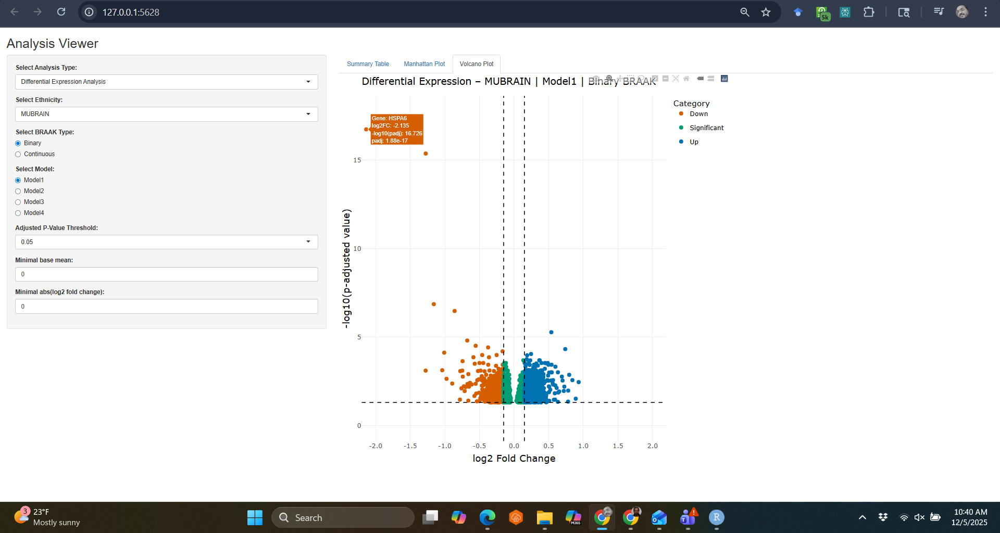
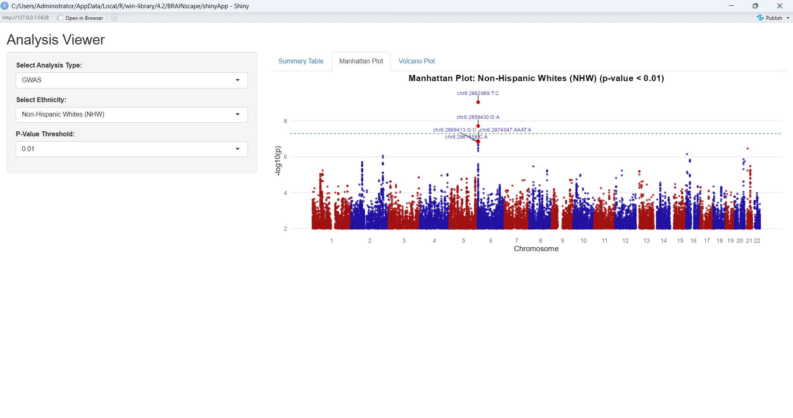

# BRAINscape: A Comprehensive Multi-Omics Analysis Tool

## Overview

**BRAINscape** is an R package designed for integrative multi-omics analysis, specifically developed for the **MU-BRAIN dataset**, a multiethnic RNAseq dataset. The package facilitates stratified **eQTL mapping** and **Differential Expression Analysis**, providing a user-friendly framework for researchers to explore genetic and transcriptomic associations.

## Features

- **eQTL Analysis**: Supports **cis** and **trans** eQTL mapping.
- **Differential Expression Analysis**: Uses **DESeq2** for robust transcriptomic profiling.
- **Interactive Data Exploration**: Shiny-based web interface for **data visualization**.
- **Supports Ethnicity-Specific Analysis**: Users can filter results by **Hispanic** and **Non-Hispanic Whites (NHW)** groups.
- **Advanced Visualization**:
  - **Manhattan Plots** for eQTL results.
  - **Volcano Plots** for Differential Expression Analysis.

## Installation

1. Install the dependencies: shiny, ggplot2, CMplot, dplyr using `install.packages(c("shiny", "ggplot2", "CMplot", "dplyr", "DT", "plotly", "ggrepel"))`
2. To install BRAINscape, first download the source file from [zenodo](https://zenodo.org/records/14925129) and then install it using the following command:

```r
install.packages("BRAINscape_1.0.0.tar.gz", repo=NULL, type="source")
```

## Usage

```r
library(BRAINscape)
BRAINscape::launchApp()
```

## Example Workflow

### 1. Load and Explore eQTL Data

```r
Select Ethinicity : Hispanics or Non-Hispanic Whites (NHW)
Select Analysis Type: eQTL
Select eQTL Type: cis or trans
Adjust Nominal P-value Threshold

# Example: Parameter selection and visualization for eQTL analysis
analysis_type <- "eQTL"
ethnicities <- "Non-Hispanic Whites (NHW)"
eqtl_type <- "trans"
gene <- "COLGALT2"
p_threshold <- 0.05

# Results will display Manhattan plots and interactive tables
```


Note: Due to large data size, the trans-eQTL data will take some time (around 10-15 secs) to load and reflect in the Shiny GUI.

### 2. Load and Explore Differential Expression Analysis Results

```r
Select Ethinicity : Hispanics or Non-Hispanic Whites (NHW) or MU-BRAIN
Select Analysis Type: Differential Gene Expression
Adjust Cutoff for p-value (adjusted), BaseMean, and Log2FoldChange

# Example: Parameter selection and visualization for eQTL analysis
analysis_type <- "Differential Expression Analysis"
ethnicities <- "MUBRAIN"
adjusted_p_threshold <- 0.05

# Results will display volcano plot and interactive tables
```



### 3. Load and Explore GWAS Analysis Results

```r
Select Ethinicity : Hispanics or Non-Hispanic Whites (NHW)
Select Analysis Type: GWAS
Adjust Nominal P-value Threshold

# Example: Parameter selection and visualization for eQTL analysis
analysis_type <- "GWAS"
ethnicities <- "Non-Hispanic Whites (NHW)"
p_threshold <- 0.05

# Results will display volcano plot and interactive tables
```




## Data Sources

- The **BRAINscape** package does not include raw data due to data sharing constraints.

## Citation

If you use BRAINscape for your research, please cite:

Yang, Z., Cieza, B., Reyes-Dumeyer, D., Lee, A., Ma, Y., Yilmaz, E., Lantigua, R., Miller, G.W., Brown, L.M., Honig, L. and Ciener, B., 2024. MU-BRAIN: MUltiethnic Brain Rna-seq for Alzheimer INitiative. bioRxiv, pp.2024-02.

Ruhela, V., Basilio Cieza Huaman, Zikun Yang, & Giuseppe Tosto. (2025). BRAINscape (1.0.0). Genetics and Genomics (Zenodo). https://doi.org/10.5281/zenodo.17831756

## Contributing

We welcome contributions! To contribute:

1. Fork the repository.
2. Make improvements.
3. Submit a pull request.

## Support

For issues and feature requests, please open a ticket on **GitHub Issues**.

## License

This package is licensed under the **Apache License**. See `LICENSE` for details.

---

**BRAINscape: Unlocking the Genetics of the Brain.**
